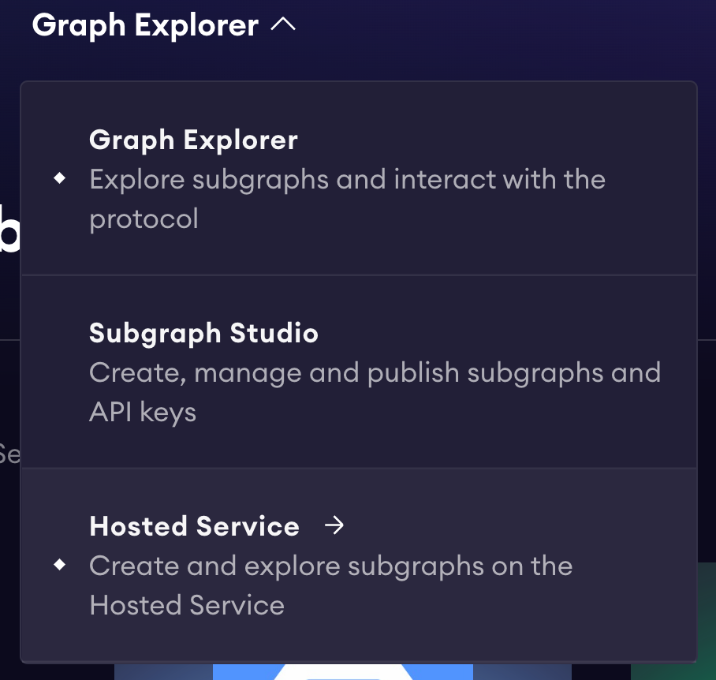
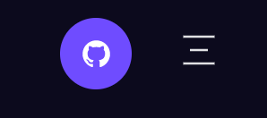
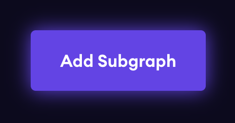
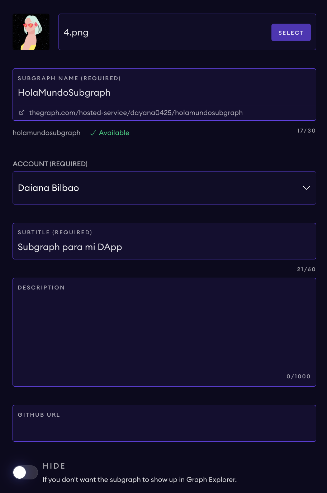

### The Graph Crash Course
#### What is The Graph?
The Graph is the indexing layer for a web3 stack. It allows blockchain developers to be able to create an indexer for smart contract data. On Ethereum & other EVM-compatible smart contracts that use Solidity or Vyper. The Graph indexes data emitted through events so that it's able to be queried via a GraphQL query API. This GraphQL API, also called a, Subgraph is an open API that can be utilized by anyone without permission, it also a decentralized API because it lives on the Graph's network. 

#### Why?
The Graph exists because Blockchains aren't optimized for reading data. They can read data if you are only trying to read one piece of data at a time but if you want to read a list of data... it is more work!

Let's say you want to retrieve the balance of a user's account given their address. This is a simple request that you'd be able to get done without writing too much code. 

However, what if you want to retrieve all the balances of all users using your DApp & sorted in descending order. Without The Graph, this would be a pain & the solution would be inefficient causing users to experience slow loading speeds.

The Graph enables you to **efficiently search, filter, and sort** your data to provide a better UX for your users, all while staying decentralized. 

#### How? 
There are three main parts to creating a subgraph:

- <b>First, you must define a Schema (schema.graphql)</b>
    - A schema defines the data stored by a subgraph and how to query it.
    - The schema here is very similar to a GraphQL schema with some minor differences. For example, instead of `@type`, we use the `@entity` directive.
    - If you are **new to GraphQL**, I recommend this tutorial to learn the basics: [click](https://www.apollographql.com/tutorials/lift-off-part1)
      - After, I would read about defining entities from The Graph's documentation: [click](https://thegraph.com/docs/en/developing/creating-a-subgraph/#graph-ql-supported-scalars)
      - & then about querying the GraphQL API: [click](https://thegraph.com/docs/en/querying/graphql-api/)
- <b>Then, you configure the subgraph manifest (subgraph.yaml)</b>
    - Here is where we define our data sources(s), templates, and some metadata for the subgraph.
      - For example, you may provide the smart contract address for the data source, info on how to map event data to entities, include add-on features, and provide a start block.
      - Why? The Graph's Node looks at our Manifest file to recieve instructions on how to index our data. Without this file, it wouldn't know what to do.
- <b>Lastly, you code the mapping logic in (src/{Name}.ts)</b>
  - The code written in this file is in AssemblyScript. This file includes `eventHnadlers` which handle the events emitted from our data source(s) to map them to the entities defined in the Schema. 
  - Let's look at a sample code from our `subgraph.yaml` file:
  
    ```
    eventHandlers:
        - event: NewGreetingCreated(bytes32,string,address,uint256)
        handler: handleNewGreetingCreated
    ```

    - Here we definied an eventHandler that maps the event emitted from our Smart Contract, `NewGreetingCreated(bytes32,string,address,uint256)`, to our handler function in src/contract.ts: `handleNewGreetingCreated()`
        - The `handleNewGreetingCreated()` function will be called everytime a `NewGreetingCreated` event is emitted. The code inside our handler function will include the logic of how it'll get mapped to our defined Entities.
    - Now let's understand the function signature of `handleNewGreetingCreated()`:
  
            ```
            export function handleNewGreetingCreated(event: NewGreetingCreated): void 
            ```
        - Notice there's a single parameter provided named `event` of type `NewGreetingCreated`. This is an object that extends the ethereum.Event class which means that the `NewGreetingCreated` type contains all the same event parameters from the emitted event. 
          - This parameter is generated automatically using the manifest event handler declaration and the provided ABI.
    - Below is a common line of code we use to `load` or get data from our subgraph.
        - We access the data from `event: NewGreetingCreated` to get the greetingId and check if this Greeting already exists. 
        - We do this to know whether we need to create a new Greeting or update an existing Greeting. 
            ```
            let newGreeting = Greeting.load(event.params.greetingId.toHex());
            ```
### Setting Up a Subgraph
Above we learned the main three components for creating a subgraph, however, there's a process for setting up our subgraph before we can code it. Below are all the steps you need to follow:

1. Go to: https://thegraph.com/explorer
2. Select 'Hosted Service' from the menu:
   
3. Connect to Github.
   
4. Go to 'Your Dashboard' by click on the Hamburger icon next to the Github sign-in.
5. Then click on 'Add Subgraph'
   
6. Fill out the form by providing the name and subtitle for your subgraph. The rest is optional. 
   
7. Ready! Now, we need to finish setting up on our terminal. 
8. Globally install the Graph CLI using Yarn so we're able to create and deploy our subgraph from our terminal.
```
yarn global add @graphprotocol/graph-cli
```
9. Execute this command from the root directory of our project. Provide your Github username & Subgraph Name.
```
graph init --product hosted-service <GITHUB-USERNAME>/<SUBGRAPH-NAME>
```
10.  Now it will ask you a series of questions about the subgraph you want to create. Choose your preferences but make sure the following stays the same (if you want to deploy to Mumbai):
* Protocol?:
    * Ethereum
* Network?: 
    * Mumbai
11.  Now you should have a new folder in your current directory! This folder includes all the necessary files to create your subgraph. You'll only need to modify the files we mentioned above:  `cd` inside of it to get started. 
12.  First, let's add this dependency which includes several useful functions which we make use of in the `src/contract.ts` file:

```
yarn add @protofire/subgraph-toolkit
```

13. Modify the `schema.graphql` file first by defining your Entities!
14. Run the following command to generate some starter code:
    ```
    graph codegen
    ```
1.  Then modify `subgraph.yaml` by updating the list of 'entities' with the ones created in the `schema.graph` file.
2.  Add to the 'source:' to include 'startBlock:'
    1.  You can find the start block by looking up your contract address on PolygonScan Mumbai & looking at a past transaction. The block number is specified there. This way, our indexer knows what block to start indexing from. 
    ```
    source:
        address: "0xa94F1Cc522A736C048A09B915633bE594D8DF914"
        abi: Contract
        startBlock: 28586872
    ```
3.  To read data stored on IPFS, we must add it to our features, which you should include under schema:
    ```
        schema:
            file: ./schema.graphql
        features:
        - ipfsOnEthereumContracts
    ```
4.  Now, we need to modify our mappings in the `src/contract.ts` file or whatever you named your file inside of the `src` directory. Here, as mentioned above, is where we write the logic for our eventHandlers using AssemblyScript.
5.  Once you're done, you can build your graph to make sure there aren't any errors.
    ```
    graph build
    ```
6. If everything look good then you're ready to deploy! Run the following command to be able to deploy (you can get your access-token from your subgraph's website that was created when you filled out the form):
    ```
    graph auth --product hosted-service <ACCESS-TOKEN>
    graph deploy --product hosted-service <GITHUB_USERNAME>/<SUBGRAPH-NAME>
    ```


##### About *this* code:
The code in this folder is meant to be a guide for you to create your own subgraph!
### ALL AVAILABLE COMMANDS - Run from the root directory.
* If you created a new subgraph, you'll have to update your `subgraph/package.json` by changing the name to `@hola-mundo-dapp/subgraph` so that it can continue to be part of the monorepo workspace & for the commands below to work.
```
yarn subgraph:codegen
yarn subgraph:build
yarn subgraph:deploy
yarn subgraph:create-local
yarn subgraph:remove-local
yarn subgraph:deploy-local
yarn subgraph:test
```

### How to use:
These commands come in handy when adding, updating, and deploying your subgraph's code.

Run the following command everytime you make changes to your schema.
```
yarn subgraph:codegen
```
Build after you make any changes to: 'schema.graphql', 'subgraph.yaml', and 'src/contract.ts' to make sure there aren't any errors. 
```
yarn subgraph:build
```
Deploy your subgraph everytime you finish making changes: 
```
yarn subgraph:deploy
```


### To connect your subgraph to the front-end & make queries, navigate to: `../next-app/helpers/apollo-client.js`
Update the URI to point to the subgraph your created:
```
uri: "https://api.thegraph.com/subgraphs/name/<GITHUB_USERNAME>/<SUBGRAPH-NAME>",
```
* `../next-app/pages/components/Filter.jsx` contains several query examples. 